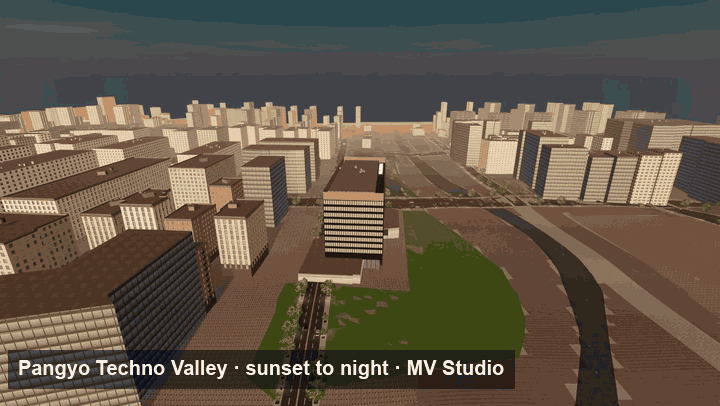
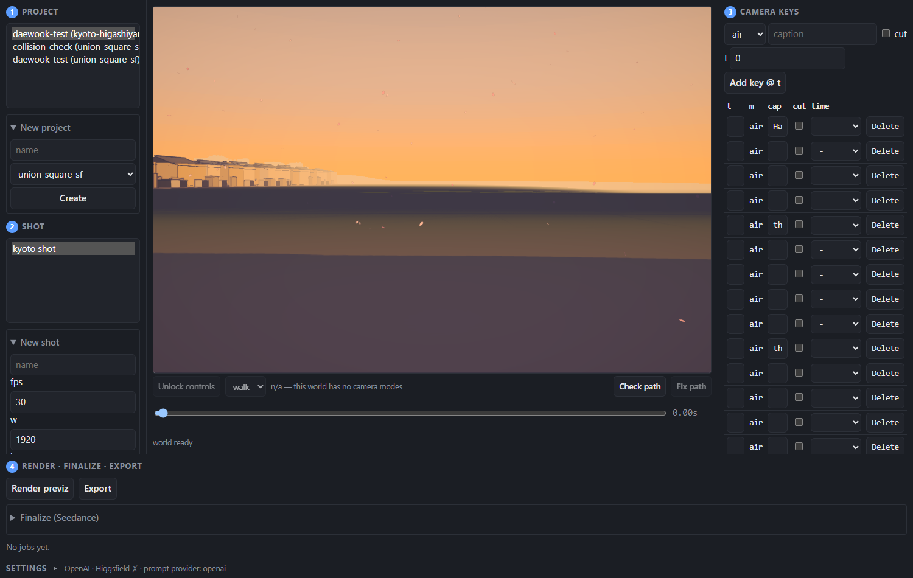
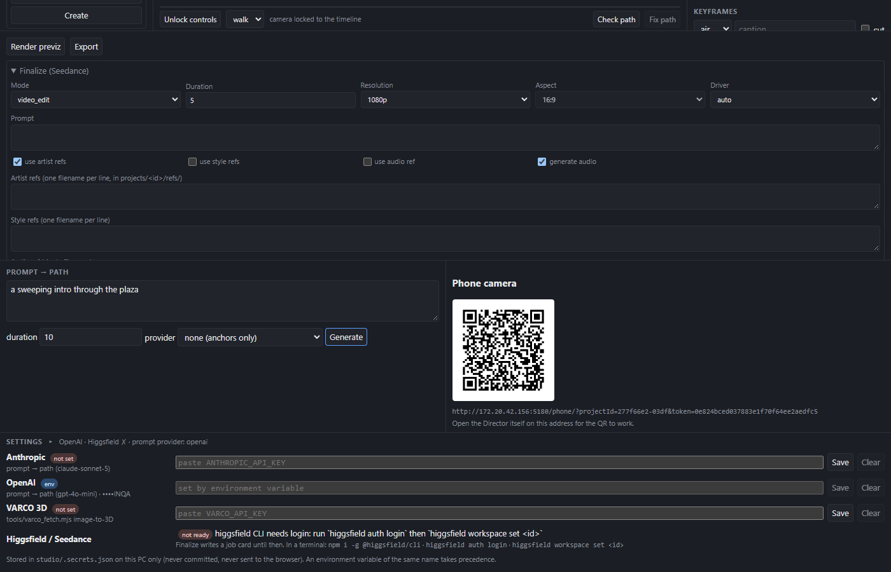
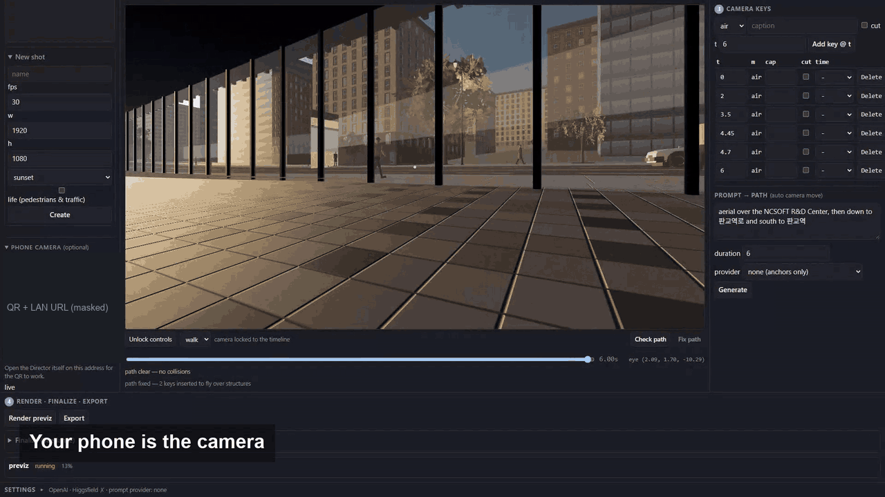
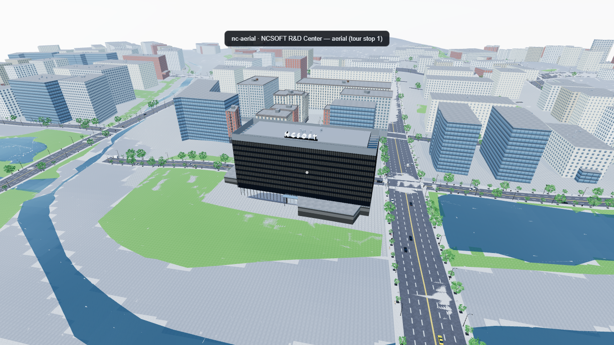
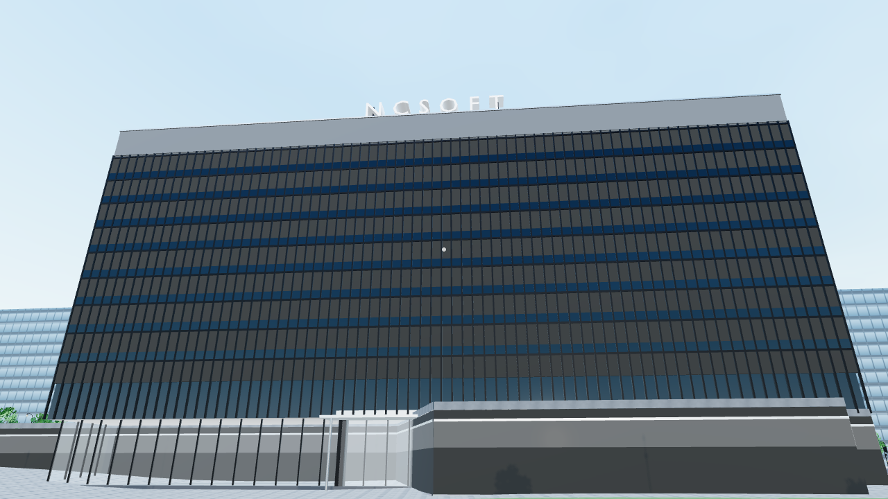
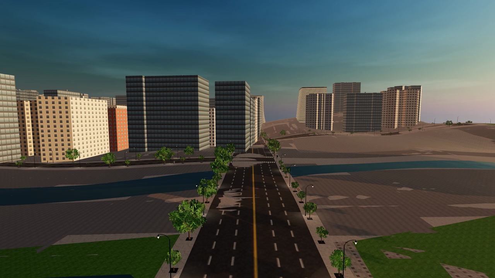

# fable51-worlds → MV Studio

> **This fork turns [PhiloLabs/fable51-worlds](https://github.com/PhiloLabs/fable51-worlds) — AI-built, walkable Three.js cities — into a music-video production tool, and adds a third city built from public map data alone.**
> Upstream is the engine. Everything below this box is what was added on top: **+51 commits, ~31k lines, 189 tests, three worlds filmable through one contract.**



<sub>▶ **[Watch the full showreel](docs/media/mv-studio-showreel.mp4)** · 69 s · 1920×1080 · 30 fps · Pangyo sunset→night, Union Square, Kyoto Higashiyama, and the Director itself — every frame rendered out of the live browser worlds by MV Studio. [Poster frame](docs/media/showreel-poster.jpg) · rebuild it with `cd studio && node tools/showreel.mjs`.</sub>

**Numbers.** `git rev-list --count upstream/main..HEAD` → **51 commits** · `git diff --shortstat upstream/main..HEAD` → **378 files, +31,034 lines** · **189 tests** (studio 115, pangyo 74) plus a postMessage-bridge check per world · **3 filmable worlds** · end-to-end pipeline (`tools/e2e.mjs`, create → prompt → previz → finalize → GLB) **196.4 s / 159.3 s / 149.2 s** for union / kyoto / pangyo.

## What this fork adds

| | Added | In one line |
|---|---|---|
| 🎬 | **[MV Studio](studio/README.md)** — a local Director UI + render server | Fly the live world in an iframe, keyframe a camera timeline, render a deterministic **previz MP4** headlessly on the GPU, hand it to **Seedance 2.5** as a motion reference, export the set as **GLB + Blender camera**. |
| 🗺️ | **Three ways to block a shot** | By hand (unlock the camera and fly), by **prompt → camera path** (LLM or an offline landmark planner — no API key needed), or with your **phone as a virtual camera** over WebSocket (QR code, gyro, record straight into keys). |
| 🧱 | **Collision-aware camera paths** | Every shot is probed against the world; red bands on the scrubber show where the camera clips a building, and **Fix path** lifts the move over the roofs automatically. Generated paths come out clean. |
| 🏙️ | **A third world from public GIS only** — [Pangyo Techno Valley](pangyo-technovalley/) | Overpass + OpenTopoData → fitted street specs → the upstream runtime, generalized so a city is data, not code. 564 buildings, 23 streets, crowds, traffic, signals, ground cover, three hero buildings (NCSOFT R&D Center with its rooftop sign, 알파돔 towers, 판교역 canopies) generated with **Blender-as-a-module**. |
| 🎨 | **VARCO / any-GLB asset injector** | Drop a generated 3D asset into a world: normalize scale and origin (bake transforms, normals included), decimate to a triangle budget, register it in the manifest, and swap it in for an existing prop — one bench becomes 26. |
| 🔐 | **Runs on your PC, keys optional** | Previz, export and the offline planner need **no API key**. Per-machine keys (Anthropic / OpenAI / VARCO) are entered in a Settings panel and stored locally; the server binds to localhost, checks Host/Origin, and spawns the Seedance CLI without a shell. |
| 🚀 | **One command** | `cd studio && npm run up` starts all three worlds, the server and the UI; `npm run down` stops them. `tools/e2e.mjs` runs create → prompt → previz → finalize → export on any world. |

---

## The feature tour

### 🎬 Director and timeline



Four numbered steps down the left and right of one screen — project, shot, camera keys, render — with the live world in an iframe in the middle and a scrubber under it. A key is `{ t, m: 'air' | 'walk', eye | pos, look, fov?, cap?, cut?, time? }` (`studio/schemas/project.mjs`), sampled by 26 lines of pure interpolation shared by the browser and the renderer (`studio/schemas/keys.mjs`), so what you scrub is exactly what the GPU renders. **Render previz** writes PNG frames and an H.264 MP4 at full resolution — 300 frames of 1080p in 85.8–147.9 s depending on the world ([measured](studio/README.md#measured-on)).

### 🧱 Collision check and Fix path



Keys interpolate in straight lines and know nothing about buildings, so the Director probes the sampled path against the *live* world at 10 Hz plus every key time (`probePath` over the postMessage bridge, a downward ray through the `world`, `props` and `vegetation` groups). Blocked stretches become red bands on the scrubber; **Fix path** inserts a key in the middle of each one, 12 m above the highest surface it crosses, and re-checks up to four times. It deliberately refuses two cases — a walk segment through a building, and a key that is *itself* inside one — because the right answer there is the creator's. [How the probe works →](studio/README.md#path-collision-check-and-auto-fix)

### 🗺️ Prompt → path, and the phone as a camera



A sentence becomes four keys with **no API key and no network**: provider `none` reads that world's own landmark anchors — `public/data/tour.json` when the world ships one (Pangyo does), else the `TOURS` table in `studio/server/prompt.mjs` — and **Generate** runs Fix path before you ever see the result. With `anthropic` or `openai` selected the model gets the same anchors as grounding and its plan is validated key by key against the schema. The phone panel shows a QR for `/phone/?projectId=…&token=…`; the phone's gyro drives the world camera live over the `/ws` relay, a swipe dollies, and the record button captures the move straight into the shot's keys. [Prompt → path](studio/README.md#prompt--path) · [Phone as a virtual camera](studio/README.md#phone-as-a-virtual-camera)

### 🏙️ Pangyo Techno Valley, from public GIS only



The first world in this repo built end to end from public map data alone: OpenStreetMap via Overpass (**564 building footprints**, 118 building parts, 794 highway ways, 378 POIs, 58 traffic-signal nodes) and SRTM elevation at 30 m via OpenTopoData, fitted into **23 street specs** and fed to a generalized copy of the upstream runtime — a city as data, not code. 277 of the 564 heights are real OSM values; the rest are estimated, and every approximation is listed in the world's own [QA report](pangyo-technovalley/FINAL_QA_REPORT.md). The same 8 s move was re-filmed at each stage: [1 — massing](pangyo-technovalley/docs/stage1-target-cut.mp4) · [2 — hero modules](pangyo-technovalley/docs/stage2-target-cut.mp4) · [3 — ground cover, routes, life](pangyo-technovalley/docs/stage3-target-cut.mp4).

### 🧱 Hero modules generated in headless Blender



Three landmarks that OSM only knows as flat polygons are generated as GLB by `blender --background --python pangyo-technovalley/tools/bpl/gen_pangyo.py` (portable Blender 4.2.9, no install), each against a hard triangle budget the script exits non-zero on: the **NCSOFT R&D Center** at 6,640 tris (mullion grid, floor bands, rooftop sign, glass entrance), the **알파돔 tower** at 5,180 and the **판교역 canopy** at 548 — budget 20,000 each. The manifest records the fit height, footprint, front axis and origin convention, including the canopy's −1.02 m stair offset, so placement never has to guess.

### 🎞️ Seedance finalize, and GLB + Blender export

The previz is the deliverable *and* the motion reference. **Finalize** hands it to **Seedance 2.5** (`video_edit`, or `omni_reference` with artist/style images) through the Higgsfield CLI, spawned as a native binary with `shell: false`; with no CLI logged in it writes `seedance-job.md` — the exact command and media list — instead of failing. **Export** writes `export/scene.glb` (the `world`, `props` and `vegetation` groups), `<shotId>.keys.json` and a `blender_import.py` that rebuilds the animated camera: 20.3 s / 39.7 MB for Union Square, 10.2 s / 30.8 MB for Pangyo, 40.1 s / 397.1 MB for Kyoto (which bakes merged vertex-coloured districts instead of instancing). [Walkthrough steps 7–8 →](studio/README.md#the-one-shot-walkthrough)

### 🎨 VARCO / any-GLB asset injector

`node studio/tools/inject_asset.mjs <file>.glb --as <category>/<name> --height <m> [--replace <rel-path>]` welds, dedups and simplifies a generated mesh to a triangle budget, bakes its transforms (normals included), re-scales it to a real-world height, writes the entry into that category's manifest (`varco/…` → `manifest_varco.json`, `pangyo/…` → `manifest_pangyo.json`) and can take the place of an existing asset — replace the bench and all 26 benches in the world become the new one. `tools/varco_fetch.mjs` gets the GLB from VARCO 3D with `VARCO_API_KEY`, and prints the manual web-export steps without one. Kyoto is the exception: it is fully procedural with no GLB kit at all, so VARCO styling there means Seedance style references, not geometry. [Details →](studio/README.md#varco-3d-assets)

### 🔐 Security and local-first

- **Nothing in the core loop needs a key.** Previz, path check, export and the anchor-based prompt planner are entirely local.
- **The server is loopback by default** (`STUDIO_BIND=127.0.0.1`) and checks `Host` and `Origin` against an allowlist of localhost plus this machine's own LAN IPv4 addresses — a WebSocket handshake is exempt from CORS, so the `/ws` upgrade is refused before it reaches the WebSocket layer.
- **The phone room needs a per-process token** carried in the QR URL; a `join` without it is closed with code `4401`. Saving or clearing keys is accepted from loopback only, so with `STUDIO_BIND=0.0.0.0` a LAN peer still cannot touch them.
- **Keys live on your machine.** Resolution order is environment → `studio/.secrets.json` (git-ignored, mode 0600, never sent back to a browser) → none; `GET /api/config` reports only `set`, `source` and a masked tail.
- **The Seedance CLI is spawned without a shell** — the native `hf` binary directly, never the `.cmd` shim — so a prompt containing `"` or `%VAR%` cannot be re-parsed by cmd.exe.

---

**Quick start** (Node 22, ffmpeg on PATH, a GPU):

```bash
cd union-square-sf && npm install && cd ../kyoto-higashiyama && npm install && cd ../pangyo-technovalley && npm install
cd ../studio && npm install && npx playwright install chromium
npm run up          # → open http://localhost:5180, pick a world, make a shot, hit Generate, Render previz
```

**How it was built.** The whole fork was produced in one continuous session with [Claude Code](https://claude.com/claude-code) (Claude Fable 5.1): a written design spec → a task plan → a fresh implementer agent per task → an independent reviewer per task → fix rounds → a final whole-branch security review. The specs and plans are in [`docs/superpowers/`](docs/superpowers/); every world ships its own QA report, defects included, in the upstream tradition.

**Credits.** The worlds, the world-authoring pipeline and the runtime are [PhiloLabs/fable51-worlds](https://github.com/PhiloLabs/fable51-worlds) (MIT). Map data © OpenStreetMap contributors (ODbL); elevation from SRTM via OpenTopoData. Seedance 2.5 via the Higgsfield CLI; VARCO 3D by NC AI.

---

# The engine underneath — upstream README

*Everything from here down is [PhiloLabs/fable51-worlds](https://github.com/PhiloLabs/fable51-worlds)' own README, kept intact, with the Pangyo world and MV Studio rows added where they belong.*

**Worlds as code. A prompt in, a world you can walk out.**

[Claude Fable 5.1](https://www.anthropic.com/claude/fable) agent swarms take a brief - a sentence, a photograph, a clip - then research the place, model it, render it, and check it. What ships is a plain [Three.js](https://threejs.org) app that opens in a browser.

No game engine. No proprietary 3D tiles. No downloaded meshes. Every building, storefront, sign, tree and traffic light is generated by code that lives in this repo.

---

## ⚔️ Head-to-head: Claude Fable 5.1 vs GPT-6 Astra

Both models' entries are one-shot results.

### Union Square, San Francisco

Same brief, same test conditions, two models. Each built Union Square from scratch, then the Astra world was filmed along the Fable walkthrough's camera route and the two are shown side by side, unedited.

<a href="union-square-sf-gpt-astra/media/fable51-vs-gpt6-astra-union-square.mp4"></a>

<sub>▶ **[Watch the head-to-head](union-square-sf-gpt-astra/media/fable51-vs-gpt6-astra-union-square.mp4)** · 59 s · left **GPT-6 Astra**, right **Claude Fable 5.1** · [Fable 5.1 build](union-square-sf/) · [GPT-6 Astra build](union-square-sf-gpt-astra/)</sub>

### Higashiyama, Kyoto

Same brief, two models. Each built Higashiyama from scratch, then the Astra world was filmed to the Fable walkthrough's shot sequence and timing. The two are shown side by side, unedited.

<a href="kyoto-higashiyama-gpt-astra/media/fable51-vs-gpt6-astra-kyoto.mp4"></a>

<sub>▶ **[Watch the Kyoto comparison](kyoto-higashiyama-gpt-astra/media/fable51-vs-gpt6-astra-kyoto.mp4)** · 53.9 s · left **Codex / GPT-6 Astra**, right **Claude Fable 5.1** · [Fable build](kyoto-higashiyama/) · [Codex source and viewer](kyoto-higashiyama-gpt-astra/) · **[Full Codex walkover GIF](kyoto-higashiyama-gpt-astra/media/kyoto-higashiyama-codex-walkover.gif)**</sub>

---

## Worlds

### 🌉 [Union Square, San Francisco](union-square-sf/)

<a href="union-square-sf/media/union-square-walkthrough.mp4"></a>

<sub>▶ **[Watch the walkthrough](union-square-sf/media/union-square-walkthrough.mp4)** · 59 s · 1920×1080 · aerial, plaza, Nintendo, lower level, Apple</sub>

### ⛩️ [Higashiyama, Kyoto](kyoto-higashiyama/)

<a href="kyoto-higashiyama/media/kyoto-higashiyama-walkthrough.mp4"></a>

<sub>▶ **[Watch the walkthrough](kyoto-higashiyama/media/kyoto-higashiyama-walkthrough.mp4)** · 54 s · 1920×1080 · seven scenes, Gion to Kiyomizu-dera at sunset</sub>

### 🏢 [판교테크노밸리, Seongnam](pangyo-technovalley/)

<a href="pangyo-technovalley/docs/stage3-target-cut.mp4"></a>

<sub>▶ **[Watch the target cut](pangyo-technovalley/docs/stage3-target-cut.mp4)** · 8 s · 1920×1080 · aerial over the NCSOFT R&D Center, down to 판교역로, south toward 판교역 · the same move at each stage: [1 — massing](pangyo-technovalley/docs/stage1-target-cut.mp4) · [2 — hero modules](pangyo-technovalley/docs/stage2-target-cut.mp4) · [3 — ground cover, routes, life](pangyo-technovalley/docs/stage3-target-cut.mp4) · [QA report](pangyo-technovalley/FINAL_QA_REPORT.md)</sub>

<sub>The first world built end to end from **public map data alone** — no survey pass, no hand-authored street specs: OpenStreetMap geometry and SRTM elevation in, a filmable world out. [How it was made →](pangyo-technovalley/README.md#how-this-world-was-made)</sub>

| World | Source data | Dev port | Status |
| --- | --- | --- | --- |
| [Union Square, San Francisco](union-square-sf/) | reconnaissance agents: survey, elevation and a storefront census → hand-authored specs | 5173 | **complete** — [walkthrough](union-square-sf/media/union-square-walkthrough.mp4), two interiors, [head-to-head vs GPT-6 Astra](union-square-sf-gpt-astra/) |
| [Higashiyama, Kyoto](kyoto-higashiyama/) | reconnaissance agents: survey + GSI elevation → hand-authored specs, fully procedural geometry | 5174 | **complete** — [walkthrough](kyoto-higashiyama/media/kyoto-higashiyama-walkthrough.mp4), seven scenes, no GLB kit at all |
| [판교테크노밸리 (Pangyo Techno Valley)](pangyo-technovalley/) | **public GIS only**: OpenStreetMap (Overpass) + SRTM via OpenTopoData, fetched and fitted by `pangyo-technovalley/tools/geo/` | 5175 | **complete (stages 1–3)** — 564 buildings, 23 fitted streets, 3 hero modules, ground cover, crowds and signals; [target cut](pangyo-technovalley/docs/stage3-target-cut.mp4), and a [QA report](pangyo-technovalley/FINAL_QA_REPORT.md) that lists what is still approximated (every street is fitted to a straight line) |

All three are filmable by [MV Studio](studio/README.md) through the same contract, and all three pass
its end-to-end pipeline check (`studio/tools/e2e.mjs`): **196.4 s / 159.3 s / 149.2 s** for create →
prompt → previz → finalize → GLB export.

*More worlds coming.*

---

## 🎬 MV Studio

**[`studio/`](studio/README.md)** — a local music-video workbench that films these worlds.

Block a shot by flying the camera around the live world in an iframe, keyframe it on a
timeline, render a **previz** MP4 headlessly at full resolution, hand that previz to
**Seedance 2.5** as a motion reference to finalize, and **export** the world as a GLB with
the camera path and a Blender import script. A phone can be used as a virtual camera, and a
sentence can be turned into a camera path.

It drives all three worlds through one small contract (`window.__twin` plus a postMessage
bridge), so a new world becomes filmable as soon as it implements it.
**[Setup, walkthrough, the world contract and troubleshooting →](studio/README.md)**

---

## Any input → a world

Text, video or image. The brief names the **subject** and the **style**, and the same pipeline runs behind all three.

| Input | A brief looks like | The world that comes back |
|---|---|---|
| 📝<br>**Text** | "Hanamikoji, Kyoto - as a hand-painted anime background" | A named place in a named style: real geometry on surveyed ground, with the look written to order |
| 🎞️<br>**Video** | a thirty-second walk-and-talk from a film | The set behind the shot, continued past the edges of frame - step off the camera path and walk the rest of it |
| 🖼️<br>**Image** | one photograph, any angle | The place in the frame as geometry: turn around, change the hour, light it differently |

Style is as open as subject. The same street can come back as a cel-shaded anime plate, a photographic reconstruction or a night scene, because each world's renderer is written for it rather than chosen from a list.

---

## Roadmap

A world is the substrate. What stands on it is the point.

| | | |
|---|---|---|
| ✅ | **Interactive scenes** | Real places, walkable in a browser - this repo |
| 🔜 | **Animation and video** | Motion as code: shot lists, camera language and continuity held across a sequence minutes long, cut from the world itself rather than generated frame by frame - anime, and documentary camera-matched to the real location |
| 🔜 | **Agent environments** | Worlds as training and evaluation environments, where the same code that builds the place also supplies the reward and the verification signal - and, played straight, an RPG |
| 🔜 | **4D, embodiment, robotics** | Scenes that change over time, and simulation where the ground truth comes free with the geometry |
| 🔜 | **Test-time scaling performance** | Measure how world quality changes with more inference time and compute |

---

## How these are made

Every stage is in the repo, and every stage can be re-run:

1. **Reconnaissance** - parallel research agents pull map geometry, elevation, transit and street specs, and a storefront census, each fact carrying its source and a confidence level.
2. **Asset generation** - scripts emit the kit a world needs: façade modules, street furniture, vehicles, vegetation, fixtures. Some worlds ship no binary assets at all and draw every texture at start-up.
3. **Runtime** - a pure Three.js app assembles terrain, streets, façades, props, crowds and traffic from JSON specs.
4. **Verification** - Playwright drives the real app, screenshots fixed viewpoints, and diffs them against photographs taken from the same spot. Independent reviewer agents - architect, geographer, technical artist, interaction - file reports that drive the next fix cycle. **Builders never grade their own work**, and every world ships its own QA report, defects included.

---

## Why code

A world written as code is not the same kind of object as a world generated as pixels or held in a latent space.

| | |
|---|---|
| **Verifiable** | You can check it by running it. Every elevation in Higashiyama is an independent survey query; a walker drives the real movement code over the whole route; Playwright diffs fixed viewpoints against photographs taken from the same spot. A wrong number is a failing test, not a matter of taste. |
| **Compositional** | The parts are reusable and legible. A townhouse generator, a roof kit, a street-plot layout engine - each is a module with a contract, and a district is a few hundred lines that calls them. |
| **Editable** | "Make the shopfront recesses deeper" is a diff, not a re-roll. The world changes exactly where you asked and nowhere else, and the change survives into every later render. |

## License

Code and generated assets: [MIT](LICENSE). Geometry is derived from [OpenStreetMap](https://www.openstreetmap.org/copyright) (ODbL), USGS 3DEP (public domain) and the GSI elevation service. Reference photographs are not redistributed here - provenance is recorded per world. Brand names and logos identify the real businesses at their real locations and belong to their owners.
