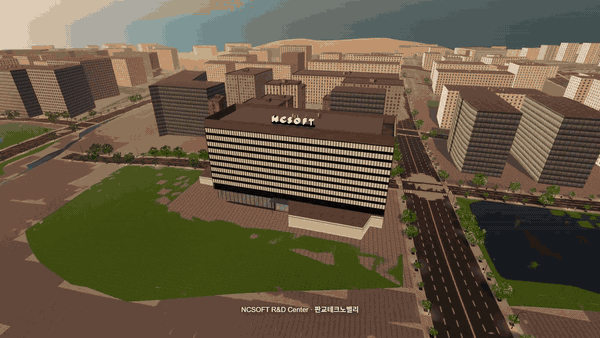

# fable51-worlds → MV Studio

> **This fork turns [PhiloLabs/fable51-worlds](https://github.com/PhiloLabs/fable51-worlds) — AI-built, walkable Three.js cities — into a music-video production tool, and adds a third city built from public map data alone.**
> Upstream is the engine. Everything below this box is what was added on top: **+49 commits, ~25k lines, 250+ tests, three worlds filmable through one contract.**



<sub>▲ 판교테크노밸리 (Pangyo, Korea) — a city that did not exist in this repo a day ago. Built from OpenStreetMap + SRTM with no manual survey, hero buildings generated in headless Blender, filmed with the timeline below. [Full 1080p cut](pangyo-technovalley/docs/stage3-target-cut.mp4) · [how it was made](pangyo-technovalley/README.md#how-this-world-was-made) · [QA report with every known defect](pangyo-technovalley/FINAL_QA_REPORT.md)</sub>

## What this fork adds

| | Added | In one line |
|---|---|---|
| 🎬 | **[MV Studio](studio/README.md)** — a local Director UI + render server | Fly the live world in an iframe, keyframe a camera timeline, render a deterministic **previz MP4** headlessly on the GPU, hand it to **Seedance 2.5** as a motion reference, export the set as **GLB + Blender camera**. |
| 🗺️ | **Three ways to block a shot** | By hand (unlock the camera and fly), by **prompt → camera path** (LLM or an offline landmark planner — no API key needed), or with your **phone as a virtual camera** over WebSocket (QR code, gyro, record straight into keys). |
| 🧱 | **Collision-aware camera paths** | Every shot is probed against the world; red bands on the scrubber show where the camera clips a building, and **Fix path** lifts the move over the roofs automatically. Generated paths come out clean. |
| 🏙️ | **A third world from public GIS only** — [Pangyo Techno Valley](pangyo-technovalley/) | Overpass + OpenTopoData → fitted street specs → the upstream runtime, generalized so a city is data, not code. 564 buildings, 23 streets, crowds, traffic, signals, ground cover, three hero buildings (NCSOFT R&D Center with its rooftop sign, 알파돔 towers, 판교역 canopies) generated with **Blender-as-a-module**. |
| 🎨 | **VARCO / any-GLB asset injector** | Drop a generated 3D asset into a world: normalize scale and origin (bake transforms, normals included), decimate to a triangle budget, register it in the manifest, and swap it in for an existing prop — one bench becomes 26. |
| 🔐 | **Runs on your PC, keys optional** | Previz, export and the offline planner need **no API key**. Per-machine keys (Anthropic / OpenAI / VARCO) are entered in a Settings panel and stored locally; the server binds to localhost, checks Host/Origin, and spawns the Seedance CLI without a shell. |
| 🚀 | **One command** | `cd studio && npm run up` starts all three worlds, the server and the UI; `npm run down` stops them. `tools/e2e.mjs` runs create → prompt → previz → finalize → export on any world. |

<p>


</p>

**Quick start** (Node 22, ffmpeg on PATH, a GPU):

```bash
cd union-square-sf && npm install && cd ../kyoto-higashiyama && npm install && cd ../pangyo-technovalley && npm install
cd ../studio && npm install && npx playwright install chromium
npm run up          # → open http://localhost:5180, pick a world, make a shot, hit Generate, Render previz
```

**How it was built.** The whole fork was produced in one continuous session with [Claude Code](https://claude.com/claude-code) (Claude Fable 5.1): a written design spec → a task plan → a fresh implementer agent per task → an independent reviewer per task → fix rounds → a final whole-branch security review. The specs and plans are in [`docs/superpowers/`](docs/superpowers/); every world ships its own QA report, defects included, in the upstream tradition.

**Credits.** The worlds, the world-authoring pipeline and the runtime are [PhiloLabs/fable51-worlds](https://github.com/PhiloLabs/fable51-worlds) (MIT). Map data © OpenStreetMap contributors (ODbL); elevation from SRTM via OpenTopoData. Seedance 2.5 via the Higgsfield CLI; VARCO 3D by NC AI.

---

# The engine underneath — upstream README

*Everything from here down is [PhiloLabs/fable51-worlds](https://github.com/PhiloLabs/fable51-worlds)' own README, kept intact, with the Pangyo world and MV Studio rows added where they belong.*

**Worlds as code. A prompt in, a world you can walk out.**

[Claude Fable 5.1](https://www.anthropic.com/claude/fable) agent swarms take a brief - a sentence, a photograph, a clip - then research the place, model it, render it, and check it. What ships is a plain [Three.js](https://threejs.org) app that opens in a browser.

No game engine. No proprietary 3D tiles. No downloaded meshes. Every building, storefront, sign, tree and traffic light is generated by code that lives in this repo.

---

## ⚔️ Head-to-head: Claude Fable 5.1 vs GPT-6 Astra

Same brief, same test conditions, two models. Each built Union Square from scratch, then the Astra world was filmed along the Fable walkthrough's camera route and the two are shown side by side, unedited.

<a href="union-square-sf-gpt-astra/media/fable51-vs-gpt6-astra-union-square.mp4"></a>

<sub>▶ **[Watch the head-to-head](union-square-sf-gpt-astra/media/fable51-vs-gpt6-astra-union-square.mp4)** · 59 s · left **GPT-6 Astra**, right **Claude Fable 5.1** · [Fable 5.1 build](union-square-sf/) · [GPT-6 Astra build](union-square-sf-gpt-astra/)</sub>

---

## Worlds

### 🌉 [Union Square, San Francisco](union-square-sf/)

<a href="union-square-sf/media/union-square-walkthrough.mp4"></a>

<sub>▶ **[Watch the walkthrough](union-square-sf/media/union-square-walkthrough.mp4)** · 59 s · 1920×1080 · aerial, plaza, Nintendo, lower level, Apple</sub>

### ⛩️ [Higashiyama, Kyoto](kyoto-higashiyama/)

<a href="kyoto-higashiyama/media/kyoto-higashiyama-walkthrough.mp4"></a>

<sub>▶ **[Watch the walkthrough](kyoto-higashiyama/media/kyoto-higashiyama-walkthrough.mp4)** · 54 s · 1920×1080 · seven scenes, Gion to Kiyomizu-dera at sunset</sub>

### 🏢 [판교테크노밸리, Seongnam](pangyo-technovalley/)

<a href="pangyo-technovalley/docs/stage3-target-cut.mp4"></a>

<sub>▶ **[Watch the target cut](pangyo-technovalley/docs/stage3-target-cut.mp4)** · 8 s · 1920×1080 · aerial over the NCSOFT R&D Center, down to 판교역로, south toward 판교역 · the same move at each stage: [1 — massing](pangyo-technovalley/docs/stage1-target-cut.mp4) · [2 — hero modules](pangyo-technovalley/docs/stage2-target-cut.mp4) · [3 — ground cover, routes, life](pangyo-technovalley/docs/stage3-target-cut.mp4) · [QA report](pangyo-technovalley/FINAL_QA_REPORT.md)</sub>

<sub>The first world built end to end from **public map data alone** — no survey pass, no hand-authored street specs: OpenStreetMap geometry and SRTM elevation in, a filmable world out. [How it was made →](pangyo-technovalley/README.md#how-this-world-was-made)</sub>

| World | Source data | Dev port | Status |
| --- | --- | --- | --- |
| [Union Square, San Francisco](union-square-sf/) | reconnaissance agents: survey, elevation and a storefront census → hand-authored specs | 5173 | **complete** — [walkthrough](union-square-sf/media/union-square-walkthrough.mp4), two interiors, [head-to-head vs GPT-6 Astra](union-square-sf-gpt-astra/) |
| [Higashiyama, Kyoto](kyoto-higashiyama/) | reconnaissance agents: survey + GSI elevation → hand-authored specs, fully procedural geometry | 5174 | **complete** — [walkthrough](kyoto-higashiyama/media/kyoto-higashiyama-walkthrough.mp4), seven scenes, no GLB kit at all |
| [판교테크노밸리 (Pangyo Techno Valley)](pangyo-technovalley/) | **public GIS only**: OpenStreetMap (Overpass) + SRTM via OpenTopoData, fetched and fitted by `pangyo-technovalley/tools/geo/` | 5175 | **complete (stages 1–3)** — 564 buildings, 23 fitted streets, 3 hero modules, ground cover, crowds and signals; [target cut](pangyo-technovalley/docs/stage3-target-cut.mp4), and a [QA report](pangyo-technovalley/FINAL_QA_REPORT.md) that lists what is still approximated (every street is fitted to a straight line) |

All three are filmable by [MV Studio](studio/README.md) through the same contract, and all three pass
its end-to-end pipeline check (`studio/tools/e2e.mjs`): **196.4 s / 159.3 s / 149.2 s** for create →
prompt → previz → finalize → GLB export.

*More worlds coming.*

---

## 🎬 MV Studio

**[`studio/`](studio/README.md)** — a local music-video workbench that films these worlds.

Block a shot by flying the camera around the live world in an iframe, keyframe it on a
timeline, render a **previz** MP4 headlessly at full resolution, hand that previz to
**Seedance 2.5** as a motion reference to finalize, and **export** the world as a GLB with
the camera path and a Blender import script. A phone can be used as a virtual camera, and a
sentence can be turned into a camera path.

It drives all three worlds through one small contract (`window.__twin` plus a postMessage
bridge), so a new world becomes filmable as soon as it implements it.
**[Setup, walkthrough, the world contract and troubleshooting →](studio/README.md)**

---

## Any input → a world

Text, video or image. The brief names the **subject** and the **style**, and the same pipeline runs behind all three.

| Input | A brief looks like | The world that comes back |
|---|---|---|
| 📝<br>**Text** | "Hanamikoji, Kyoto - as a hand-painted anime background" | A named place in a named style: real geometry on surveyed ground, with the look written to order |
| 🎞️<br>**Video** | a thirty-second walk-and-talk from a film | The set behind the shot, continued past the edges of frame - step off the camera path and walk the rest of it |
| 🖼️<br>**Image** | one photograph, any angle | The place in the frame as geometry: turn around, change the hour, light it differently |

Style is as open as subject. The same street can come back as a cel-shaded anime plate, a photographic reconstruction or a night scene, because each world's renderer is written for it rather than chosen from a list.

---

## Roadmap

A world is the substrate. What stands on it is the point.

| | | |
|---|---|---|
| ✅ | **Interactive scenes** | Real places, walkable in a browser - this repo |
| 🔜 | **Animation and video** | Motion as code: shot lists, camera language and continuity held across a sequence minutes long, cut from the world itself rather than generated frame by frame - anime, and documentary camera-matched to the real location |
| 🔜 | **Agent environments** | Worlds as training and evaluation environments, where the same code that builds the place also supplies the reward and the verification signal - and, played straight, an RPG |
| 🔜 | **4D, embodiment, robotics** | Scenes that change over time, and simulation where the ground truth comes free with the geometry |

---

## How these are made

Every stage is in the repo, and every stage can be re-run:

1. **Reconnaissance** - parallel research agents pull map geometry, elevation, transit and street specs, and a storefront census, each fact carrying its source and a confidence level.
2. **Asset generation** - scripts emit the kit a world needs: façade modules, street furniture, vehicles, vegetation, fixtures. Some worlds ship no binary assets at all and draw every texture at start-up.
3. **Runtime** - a pure Three.js app assembles terrain, streets, façades, props, crowds and traffic from JSON specs.
4. **Verification** - Playwright drives the real app, screenshots fixed viewpoints, and diffs them against photographs taken from the same spot. Independent reviewer agents - architect, geographer, technical artist, interaction - file reports that drive the next fix cycle. **Builders never grade their own work**, and every world ships its own QA report, defects included.

---

## Why code

A world written as code is not the same kind of object as a world generated as pixels or held in a latent space.

| | |
|---|---|
| **Verifiable** | You can check it by running it. Every elevation in Higashiyama is an independent survey query; a walker drives the real movement code over the whole route; Playwright diffs fixed viewpoints against photographs taken from the same spot. A wrong number is a failing test, not a matter of taste. |
| **Compositional** | The parts are reusable and legible. A townhouse generator, a roof kit, a street-plot layout engine - each is a module with a contract, and a district is a few hundred lines that calls them. |
| **Editable** | "Make the shopfront recesses deeper" is a diff, not a re-roll. The world changes exactly where you asked and nowhere else, and the change survives into every later render. |

## License

Code and generated assets: [MIT](LICENSE). Geometry is derived from [OpenStreetMap](https://www.openstreetmap.org/copyright) (ODbL), USGS 3DEP (public domain) and the GSI elevation service. Reference photographs are not redistributed here - provenance is recorded per world. Brand names and logos identify the real businesses at their real locations and belong to their owners.
