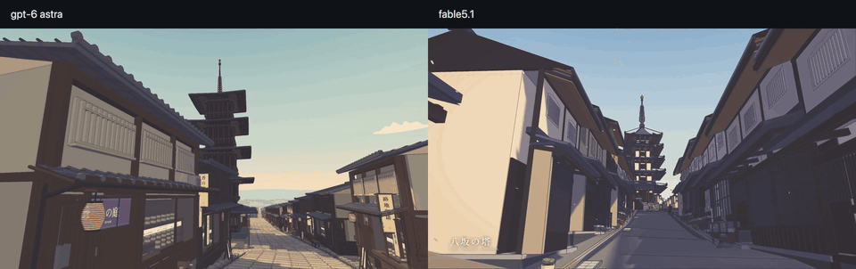

# Higashiyama, Kyoto — Codex / GPT-6 Astra

**Codex's one-shot submission** for the Kyoto comparison in fable51-worlds. This folder contains the complete procedural scene, a minimal Three.js viewer, the recording tools and the original QA findings.

<a href="media/fable51-vs-gpt6-astra-kyoto.mp4"></a>

<sub>▶ **[Watch the comparison](media/fable51-vs-gpt6-astra-kyoto.mp4)** · 53.9 s · left **Codex / GPT-6 Astra**, right **Claude Fable 5.1** · [Fable scene](../kyoto-higashiyama/)</sub>

**[Full Codex walkover GIF](media/kyoto-higashiyama-codex-walkover.gif)** · **[1080p MP4](media/kyoto-higashiyama-codex-walkover.mp4)** · 65.9 s, including the timber stage and entire-scene overview.

The comparison follows Fable's seven-beat order and timing using this scene's authored viewpoints. Camera positions, scale, lighting and some depicted subareas differ: it is not an exact camera-matched comparison. The scene was frozen before the Fable film was inspected. “One-shot” names one submitted build, whose autonomous creation included its own research and QA iterations; the later user revision requested this minimal viewer. See [comparison methodology and mismatches](media/COMPARISON.md).

## 3D viewer

A full-screen viewer for the procedural Kyoto environment. The scene opens immediately with orbit, pan and zoom controls and a small viewpoint selector.

## Run

```sh
npm install
npm run dev
```

Open **http://localhost:5180**.

```sh
npm run build
npm run preview
```

The runtime uses Three.js 0.180.0, JavaScript and Canvas2D with Vite. The Kyoto geometry, signage, toon materials and depth-derived ink are generated in code.

The production build uses relative asset paths, so `dist/` can be served under a nested URL. Include `THIRD_PARTY_NOTICES.md` with separately distributed builds. The QA gallery is served by the development server and remains source evidence; Vite does not copy it into `dist/` automatically.

## Viewer controls

| Input | Action |
|---|---|
| Left drag | Orbit around the current view center |
| Right drag / arrow keys | Pan |
| Scroll / middle drag | Zoom |
| Touch drag | Orbit |
| Pinch / two-finger drag | Zoom / pan |
| Viewpoint selector | Frame a district or the entire scene |
| Reset button / R | Restore the selected viewpoint |
| Fullscreen button | Enter or leave fullscreen |
| O / G | Debug shortcuts for ink / grade |

Viewpoints cover Yasaka Pagoda, Gion, Yasaka Shrine, Ninenzaka/Sannenzaka, Kiyomizu-dera and the entire scene. The original procedural world and generators are preserved.

## Architecture

- **`src/world/route.js`** — the east/south coordinate system, 19 named subareas, connected centerlines, map destinations and route interpolation.
- **`terrain.js`** — authoritative ground, graded architectural pads, real stair treads, elevated timber walkables, and the ravine below the stage. `heightAt()` gives the accessible surface; `terrainAt()` gives the earth underneath bridges and decks. Their separate rendered surfaces are intentional.
- **`machiya.js`** — real recessed entries, stocked display depth, lattice, shutters, deep eaves, modeled tile relief, gutters, modern services and Kyoto inuyarai.
- **`signage.js`** — cached Canvas2D shop boards, vertical typography, noren, menus, lantern inscriptions, price strips and temple plaques.
- **`shrine.js`, `pagoda.js`, `temple.js`** — Yasaka's west gate, north/south precinct axis, lantern pavilion, five-tier Hōkan-ji, Nio-mon, main hall and stage support grid.
- **`street.js`, `details.js`, `dressing.js`, `context.js`** — paving, gutters, utilities, ceramics, bicycles, vending, cats, pocket gardens, alley walls and surrounding town fabric.
- **`vegetation.js`** — centralized, spatially batched sakura, maple, pine, cedar, bamboo, shrubs, ground petals and falling petals. Bright blossom does not receive shadow.
- **`batching.js`** — static geometry merges by material and spatial cell; moving cloth and lantern pivots survive batching.
- **`src/core/toon.js`** — cached quantized ramps and a cool shadow-hue shader patch.
- **`post.js`** — half-float scene/depth → linear-depth second-difference ink → paper/violet split grade → FXAA. No bloom, depth of field or motion blur.
- **`outline.js`** — selected inverted-hull silhouettes, preserved through world batching.
- **`player.js`** — the earlier walking controller, retained as source; the viewer uses Three.js OrbitControls.
- **`heroes.js`** — 34 authored cameras.
- **`sky.js`** — procedural painted sky, hills and city backdrop. The earlier audio module is retained as source.

`src/main.js` assembles the scene, lighting, OrbitControls, six viewpoint presets, reset/fullscreen controls and screenshot hooks.

## Screenshot and QA tools

```js
await __shot('pagoda-classic', 1600, 900);
await __shot('custom', 1600, 900, {
  pos: [233, 44, 215], target: [189, 19, 182], fov: 48
});
__kyoto.showView('kiyomizu');
__kyoto.setMode('viewer');
__kyoto.stats();
```

`__shot()` returns an unmodified PNG data URL and camera/render statistics. The 34 original hero cameras remain available to the development tooling. Dragging the canvas resumes orbit controls after a screenshot.

```sh
npm run qa
node qa/capture.mjs --url http://localhost:5180 --output qa/new-captures
```

The current viewer check exercises orbit, pan, zoom, reset, all six viewpoints, fullscreen, image export and responsive sizing. It writes `qa/viewer-verification.json` and screenshots under `qa/viewer/`. It uses local Chrome through the development-only Playwright dependency; set `KYOTO_CHROME` for a different Chrome executable.

The original capture gallery is at **http://localhost:5180/qa/gallery.html**. The earlier first-person app checks and walkthrough results remain historical development evidence; `npm run qa` now tests the viewer. The original geography and image reviews in `FINAL_QA_REPORT.md` still describe the underlying model's fidelity limitations.

The repository package includes all 34 final hero PNGs, the current viewer captures, review reports, movement/performance JSON and the final historical walking frame. Intermediate image iterations and the other historical walking frames are omitted. Copyrighted research photographs are excluded; their original URLs remain in the reference ledger. Source geometry and procedural generators are complete. Japanese lettering uses local CJK fonts with a Google Fonts CSS fallback; install Japanese fonts on systems that lack them.

## Geographic interpretation

Local +X is east and +Z is south, with the Gion-Shijo edge near **35.0038° N, 135.77259° E** as datum. OSM landmark positions use approximately 0.30 horizontal distance compression. Doorways, shop details, stairs and walking speed retain human scale. The model preserves the route's topology, the downhill westward pagoda view, southward stair climbs and Kiyomizu's south-facing stage.

Elevations, individual lots, shop names and storefront ordering are authored interpretations. This is not a surveyed digital twin or a real-world navigation tool. Google Earth and interactive Street View were not inspected, and no proprietary Google geometry or textures were imported. The historical buildings are simplified reconstructions; the visible access areas are interpreted for this environment.

Research, source links and uncertainty are recorded in [docs/GEOGRAPHY.md](docs/GEOGRAPHY.md) and [docs/REFERENCES.md](docs/REFERENCES.md). The research table and implementation use the same Gion-Shijo datum. OSM attribution: © [OpenStreetMap contributors](https://www.openstreetmap.org/copyright), ODbL. Documentation photographs are reference material, not runtime textures.

## Reference and attribution

[Sakura Crossing by Kenton Wang](https://github.com/Kenton-GMI/sakura-crossing) was studied at source level before implementation. Its MIT-licensed renderer/material/outline utilities informed and partly underpin this project. Kyoto's local coordinate system, graded route, district layout, architecture and interface are separate authored work. The study records are [REFERENCE_RENDERER.md](docs/REFERENCE_RENDERER.md) and [REFERENCE_WORLD.md](docs/REFERENCE_WORLD.md). See [THIRD_PARTY_NOTICES.md](THIRD_PARTY_NOTICES.md) for the full required notices. No reference-repository music is included.
