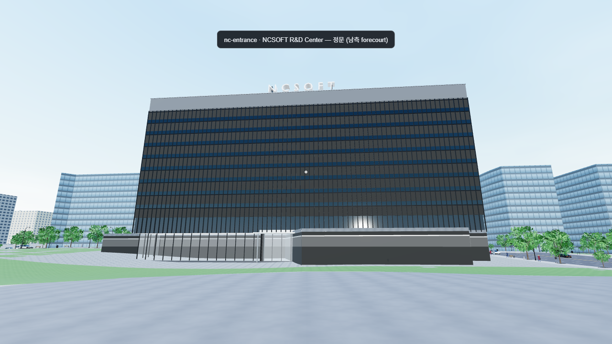
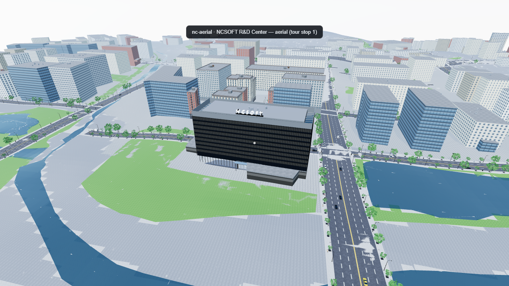
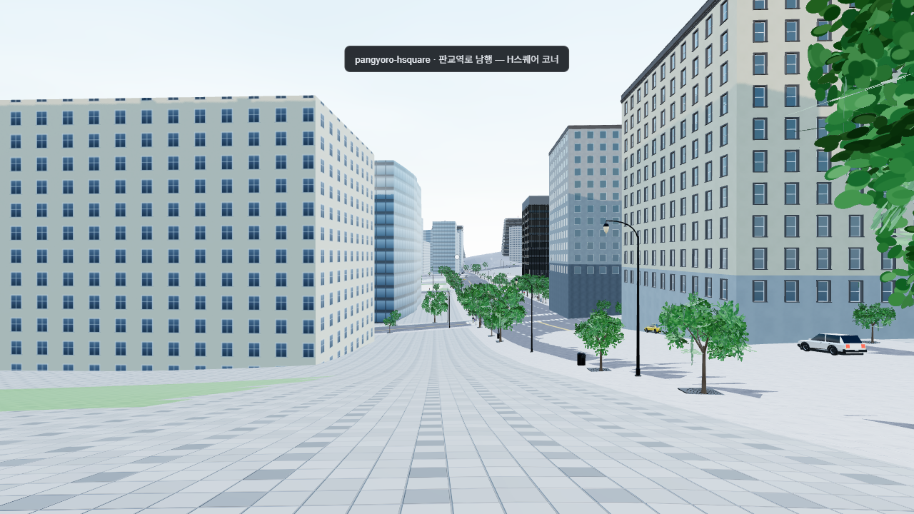
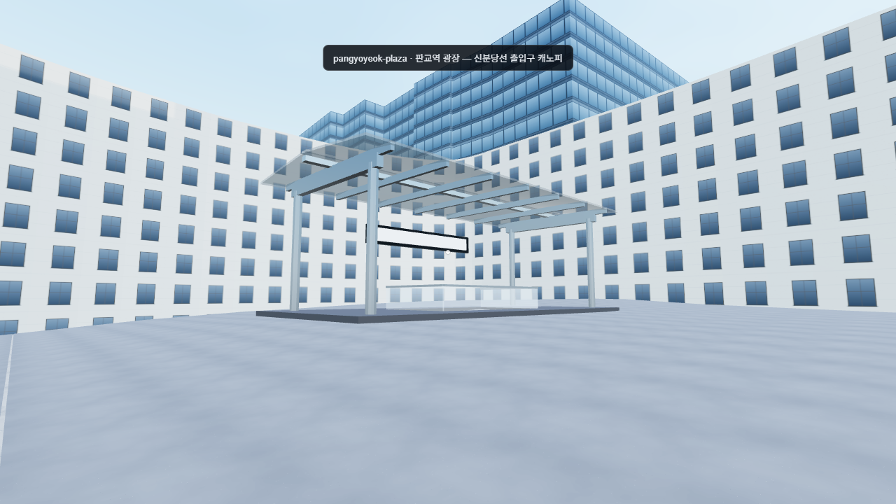

# FINAL QA REPORT — Pangyo Techno Valley (pangyo-technovalley)

Generated 2026-09-08 08:40:16Z by `tools/qa/qa_report.mjs` (stage 3).

## Reconstruction boundary

WGS84 bbox 37.395–37.4065 N, 127.099–127.117 E (≈ 1.28 km N–S × 1.59 km E–W): 판교테크노밸리 and 판교역/알파돔, centred on the NCSOFT R&D Center. Local frame origin = the area centroid of OSM way 694434545 (엔씨소프트 R&D 센터), lat 37.399371, lon 127.108722, ground elevation 37 m; grid bearing 84.541° (local +x = grid east, +z = grid south, y = 0 at the NC building's ground level).

## Data provenance and attribution

| Layer | Source | Notes |
|---|---|---|
| Buildings, building parts, roads, POIs, signals, crossings, benches | **OpenStreetMap** via the Overpass API (`tools/geo/fetch_osm.mjs`), snapshot `2026-09-08T04:08:23Z` | 564 footprints (435 inside the bbox) + 118 parts, 794 highway ways, 378 POIs, 58 traffic-signal nodes, 65 crossing nodes |
| Ground cover (landuse / leisure / parking / water) | **OpenStreetMap**, fetched by `fetch_osm.mjs --augment` and binned by `build_gis.mjs` | 232 polygons — added in stage 3 for the block fill |
| Elevation | **OpenTopoData `srtm30m`** (SRTM 1-arcsec, EGM96), 25 m grid; per-point fallback AWS Terrarium tiles zoom 14 | as recorded in `gis.json.meta.elevationSource` |
| Building heights | OSM `height` → `building:levels × 3.6 + 1` → `heights_override.json` → area default | resolution order recorded per building in `heightSource` |
| Bus routes / stop positions | OSM `public_transport=platform` nodes and their `route_ref` tags | 6 routes authored in `src/data/recon/routes.json`; **no timetable is modelled** |
| Models / textures | Generated in-repo (BPL kit + procedural Three.js materials), MIT | no third-party assets |

> **Map data © OpenStreetMap contributors, available under the Open Database Licence (ODbL): https://www.openstreetmap.org/copyright**
> SRTM elevation data is public domain (NASA/USGS).
> Reference photography is **not** redistributable (Kakao/Naver road view) and is therefore not committed — see `photos/README.md`.

## What is real, and what is approximated

**Real (measured from public data):** building footprints and their positions; 277 of 564 building heights; the street network's names, widths (OSM `width` or `lanes × 3.25 m`), lane counts and one-way flags; traffic-signal and crossing node positions; bus-stop platform positions and route numbers; ground-cover polygons; terrain shape at 30 m horizontal resolution.

**Approximated (authored or inferred):** every street is a straight, axis-aligned line (see defect 8); façades are procedural; the three hero modules (NC R&D Center, 판교역 canopies, 알파돔 tower massing) are procedural Three.js geometry, not surveyed models; there are no interiors; the terrain is a smoothed SRTM heightfield with no cut-and-fill; block fill is a flat patch draped on that heightfield; signal timing is a synthetic 60 s coordinated cycle, not the real plan; the pedestrian and vehicle populations are synthetic.

## Counts

| Metric | Value |
|---|---|
| OSM building footprints | 564 (+ 118 building parts) |
| Buildings with procedural façades | 18 |
| Hero modules | 4 building(s) + 3 station canopies |
| Fitted streets | 23 (8 ns / 15 ew, 2 dropped) |
| Grid crossings | 19, of which **14 signalised** (6 from OSM signal nodes, 8 from the major×major fallback) |
| Signal masts placed / lamp heads driven | 42 / 42 |
| Street lamps / trees / benches placed | 427 / 441 / 15 |
| Ground-cover polygons used | 232 OSM areas + 1,607 fallback block patches |
| Block-fill draw calls / triangles | **5** / 188,946 |
| Reference viewpoints | 4 (0 with photos — captures are local only) |
| Tour stops | 6 |

### Block fill by surface

| Surface | Patches | Triangles |
|---|---|---|
| `paving` | 80 | 56,158 |
| `paving_dark` | 1,627 | 97,882 |
| `grass` | 96 | 23,532 |
| `soil` | 20 | 1,584 |
| `water` | 9 | 9,790 |

## Viewpoints

All four cameras are defined in `src/data/recon/viewpoints.json` in local coordinates **and** WGS84, and are checked twice before
the screenshot: `__twin.probePath` at 0.9 m clearance (walls and structure) **and** against the 441 placed street trees,
which have no collider at all and so pass `probePath` while filling the frame: a camera must stand 2 m clear of every
tree in plan **and** have none inside a 2.5 m-wide sight corridor for the first 18 m ahead of it.

| id | Title | Camera (x, y, z) | Probe + trees | Screenshot |
|---|---|---|---|---|
| `nc-entrance` | NCSOFT R&D Center — 정문 (남측 forecourt) | 0.0, 3.7, 115.0 | clear (nearest tree 69.87 m) |  |
| `nc-aerial` | NCSOFT R&D Center — aerial (tour stop 1) | 40.0, 140.0, 220.0 | clear (nearest tree 29 m) |  |
| `pangyoro-hsquare` | 판교역로 남행 — H스퀘어 코너 | 113.0, 21.1, -276.0 | clear (nearest tree 13.51 m) |  |
| `pangyoyeok-plaza` | 판교역 광장 — 신분당선 출입구 캐노피 | 152.0, 13.0, 549.0 | clear (nearest tree 63.48 m) |  |

## Life systems

Simulated with `__twin.stepLife` (fixed 1/30 s steps), so the numbers are deterministic and independent of frame rate.
The **at boot** column is read once, immediately after `__twin.ready`, before the viewpoint screenshots; the world then ran
3.2 s of real time (four screenshots) before the 30 s of simulated time in the second column.

| Metric | at boot | + 30 s simulated |
|---|---|---|
| Pedestrians alive | 220 | 220 |
| …on a sidewalk / plaza | 220 | 218 |
| …at a NaN position | 0 | 0 |
| Vehicles alive | 104 | 102 |
| …moving / stopped | 104 / 0 | 90 / 12 |
| …at a NaN position | 0 | 0 |
| Route vehicles (of 6 routes) | 6/6 | 6/6 |
| Unresolved routes (warnings) | 0 | 0 |
| Nav graph | 2,254 nodes / 2,278 edges | — |
| Pedestrian update cost | 1.74 ms (max 3.43 ms) | 0.68 ms |

### Transit routes

| Route | Street | Dir | Lane | Stops | min m/s | max m/s | red-light stops (60 s) | stops served |
|---|---|---|---|---|---|---|---|---|
| 9007 판교역 방면 | 판교역로 | S | curb | 4 | 0 | 11.01 | 5 | 1 |
| 9007 판교테크노밸리 방면 | 판교역로 | N | curb | 4 | 0 | 10.04 | 35 | 2 |
| 101 대왕판교로 남행 | 대왕판교로 | S | curb | 3 | 0 | 11.2 | 0 | 1 |
| 101 대왕판교로 북행 | 대왕판교로 | N | curb | 3 | 0 | 11.01 | 0 | 1 |
| 3100 판교로 동행 | 판교로 | E | curb | 3 | 0 | 11.18 | 248 | 0 |
| 3100 판교로 서행 | 판교로 | W | curb | 3 | 0 | 10.46 | 0 | 1 |

### Traffic-light smoke

Over 60 s of simulated time the route vehicles came to a full stop at a signalised stop bar showing red/amber **288 times** (3 of 6 routes) — **PASS**. Background traffic was also observed stopped at red on 56 of the 60 sampled steps. First observed stop: 9007 판교역 방면 at t = 25.8 s, 판교역로 junction (85.1, -148.4), signal red.

Signals: 14 controlled crossings driving 42 lamp heads on a 60 s coordinated cycle (NS green 25 → amber 3 → all-red 2 → EW green 25 → amber 3 → all-red 2, read back from `TrafficLights.stats()`) with a per-junction offset. Pedestrian crossings read the same clock.

## Cost

| Metric | Value |
|---|---|
| Cold boot (launch → `__twin.ready`, headless) | 7,583 ms |
| In-page load (`[pangyo] load`) | 4,616 ms |
| Draw calls (aerial viewpoint, 1280×720) | 782 |
| Triangles submitted | 4,281,824 |
| Geometries / textures resident | 741 / 53 |
| Page errors during the run | none |

## Defects

1. **판교역로 straight fit overlaps real massing** _(high)_ — 판교역로 is fitted as a single straight ns line at x = 85.09 with a 29.25 m carriageway. The real road bends; the fit therefore runs through the 삼성화재 / 카카오판교아지트 massing on the east side around z = −120 … +40, and the OSM H스퀘어 bus platforms (07479 / 07034) land inside the carriageway rather than on the kerb.
2. **East side of 판교역로 is bare** _(high)_ — OSM has almost no building heights on the east flank of 판교역로 north of 판교역, so those blocks fall back to the area-based default height and read as low grey boxes next to the 12-storey west side.
3. **Dark glass** _(medium)_ — The procedural curtain-wall style uses `glass_dark` for towers > 40 m. In daylight the NC building and the 알파돔 towers read almost black rather than the real blue-green; no reflection probe is baked, so `envMapIntensity` is doing all the work.
4. **Canopy yaws unsurveyed** _(medium)_ — The three 판교역 canopies are placed on the OSM `railway=subway_entrance` nodes with `yaw: 0` (grid-aligned). Their real orientation was never surveyed — treat the canopy angles as decoration, not as geometry.
5. **알파돔 towers scaled to OSM height** _(medium)_ — The 알파돔시티 towers are massing scaled to whatever `height` / `building:levels` OSM carries. Where OSM has neither, they take the area default, so the tower group's silhouette is indicative only.
6. **Thin façade sliver near 판교역** _(low)_ — Some footprints near the station are long and 3–5 m deep (OSM canopy/podium outlines). The façade builder still details them, producing thin slivers of curtain wall with no depth.
7. **No interiors** _(low)_ — Nothing in this world is enterable. `probePath` reports the massing as solid; there are no floors, lobbies or storefront interiors (union-square-sf has two, this world has none).
8. **Straight-fit street grid** _(high)_ — Every street is axis-aligned by construction (`tools/geo/build_streets.mjs`): bearing folded to the grid, `c` = length-weighted mean offset. 경부고속도로 (9.5° off-axis), 대왕판교로 (9.6°) and 분당내곡로 (9.4°) are visibly straighter than reality, and two named ways (판교로227번길, 판교로255번길) were dropped for being > 25° off both axes.
9. **Ground cover now spans the whole extract (fixed)** _(low)_ — The fallback block fill used to stop at a symmetric ±620 m box, so the outer third of the reconstruction was bare white terrain with streets running off into nothing. It now covers the full local bbox (x −903…805, z −870…553 — `BlockFill.FILL_BBOX` = `geo.localBbox()`) at the terrain's own 8 m resolution, so the fill ends exactly where the OSM extract does and not before. What remains is the extract boundary itself: beyond it there is no data of any kind.
10. **Terrain is SRTM 30 m** _(medium)_ — Elevation is SRTM 1-arcsec sampled on a 25 m grid and IDW-gridded at 8 m. Cut-and-fill, podium platforms, underpasses (화랑지하차도, 낙생고가차도) and the 판교역 box are not modelled — streets and block fill are simply draped on the smoothed heightfield.
11. **Generic façades** _(medium)_ — Façades are procedural (`AutoSpec`), not surveyed: bay widths, floor heights and materials are inferred from the footprint and height. Only the NC R&D Center has an authored spec.
12. **No storefront census** _(low)_ — This world ships no `storefronts.json`, so no ground-floor tenant is identified; every retail bay is a blank fascia even where OSM has a shop POI at that address.
13. **Water is a coloured surface, not a modelled channel** _(medium)_ — Stage 3 shipped the water class flat and opaque and the 운중천 / 금토천 read as a pale flood plain. It is now a darker blue-grey at alpha 0.75 (`src/materials/Library.ts`), and the ground cover underneath it is cut away (`BlockFill.TRANSLUCENT_SURFACES`) so what shows through is the terrain rather than the park grass and its three rectangular pitches, which used to be plainly visible on the river bed. It is still one patch draped on the SRTM heightfield: no normal map, no flow, no ripple, no bank geometry and no cut-in bed — the terrain does not dip under the water, so the surface sits at ground level + 5 cm wherever OSM drew the polygon. Treat any watercourse in a frame as a coloured surface.
14. **Block-fill patch seams and mottling** _(medium)_ — The ground cover is rasterised on an 8 m grid and merged per surface class, and each patch carries planar `uv = (x, z)`. Neighbouring patches meet on hard cell lines, the procedural paving/concrete textures tile visibly at that pitch, and the per-class millimetre y-offsets show as faint edges where two classes abut. In the QA frames this reads as blotching across the 판교역 forecourt and the NC block. Nothing is missing — it is one flat material stretched over a whole block.
15. **판교역 forecourt is generic block fill** _(medium)_ — The `pangyoyeok-plaza` viewpoint was re-sited in stage 3.1 (from x 186 / z 507 heading 205° to x 152 / z 549 heading 39°) so that the 신분당선 entrance canopy is centred with the 알파돔 tower behind it instead of small against a blank curtain wall. It is the best probe-clear stand available: every position nearer the canopy is inside the surrounding massing. The frame is still weak for a reason no camera can fix — there is no station box, no plaza module, no furniture and no signage here, only three canopies dropped on the OSM `subway_entrance` nodes and a flat paved patch.
16. **`pois` excludes ground-cover areas** _(low)_ — Every OSM way/relation that lands in the `landuse` ground-cover bin is now kept OUT of `gis.json.pois` (`tools/geo/build_gis.mjs` §7): `fetch_osm --augment` had filed all 232 areas as points of interest as well, so parks, car parks and ponds came back as POIs and were double-counted by anything reading that bin. The count fell 460 → 378, with no change to buildings (564), fitted streets (23) or the NC height (58 m). A POI census that wants those areas should read `landuse` alongside `pois`.
17. **Most OSM signal nodes collapse onto few junctions** _(medium)_ — 58 OSM `highway=traffic_signals` nodes snap onto only 6 fitted junctions (6 matched within 30 m); the straight-fit grid has 19 crossings where the real network has far more, so signal placement is coarse. 8 further junctions were signalised by the major×major fallback.

## Next steps

- Fit 판교역로 and 대왕판교로 as polylines rather than single straight lines (the runtime lane graph would need a curved-link mode), which would also put the OSM bus platforms back on the kerb.
- Author `heights_override.json` entries for the east side of 판교역로 (삼성화재, 카카오, 유스페이스2) so those blocks stop using the area default.
- Bake a small environment probe per time preset so `glass_dark` reads as glass rather than as black in daylight.
- Add a `plaza.json` for the 판교역 forecourt so the station area gets a proper paved slab, plaza furniture and a pedestrian lattice instead of the generic block fill.
- Survey the three canopy yaws from road view and replace `yaw: 0` in `hero_props.json`.
- Drop creator captures into `photos/` and wire them into `viewpoints.json` so the reference overlay (`?ref=1`) can be used for a real side-by-side.
