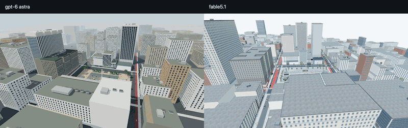

# Union Square, San Francisco — the GPT-6 Astra build

The same Union Square brief, given to **GPT-6 Astra** instead of Claude Fable 5.1, under the same test conditions. This folder is the Three.js world it produced, plus the side-by-side video against the [Fable 5.1 build](../union-square-sf/).

<a href="media/fable51-vs-gpt6-astra-union-square.mp4"></a>

<sub>▶ **[Watch the head-to-head](media/fable51-vs-gpt6-astra-union-square.mp4)** · 59 s · left **GPT-6 Astra**, right **Claude Fable 5.1** · same camera route: aerial, Dewey Monument, Nintendo, lower level, Apple</sub>

```bash
npm install
npm run dev     # http://127.0.0.1:5173
```

Click the view to look around · `WASD` move · `Shift` faster · `Q` `E` down / up in free camera · `F` interact · the panel switches viewpoint, camera mode, day / golden hour / night, quality, and a short guided tour · `?dev=1` opens the photo-reference comparison overlay

Chrome is the tested browser. The renderer needs WebGL2 only; WebGPU is not required.

## How the comparison was made

- Both models received the same brief and worked under the same conditions: research the real location, model it, render it in plain Three.js, and check it in the browser. The Astra scene was frozen before the Fable walkthrough was viewed.
- The Astra world was then filmed along the Fable walkthrough's shot list, at the same timing, and the two 1920×1080 recordings were placed side by side at equal size with no cropping, grading or re-rendering.
- Four meshes in `public/models/` (Dewey Monument, pedestrian, cable car, retail displays) were authored in Blender through MCP by the Astra agent; everything else is generated at start-up. No downloaded models or external asset services were used.
